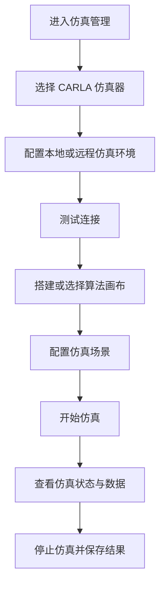
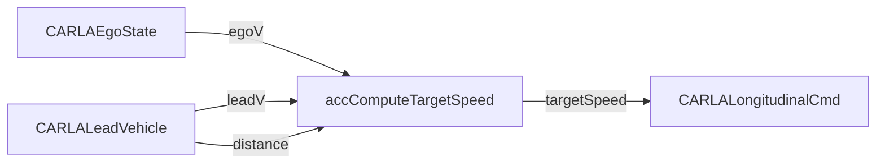
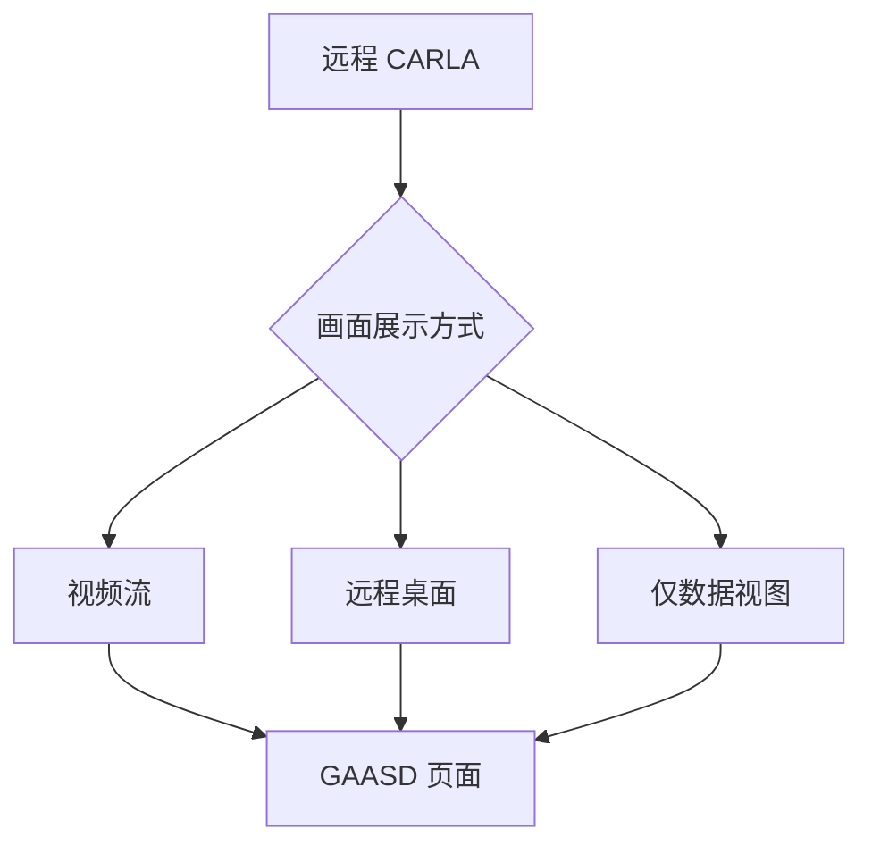

# GAASD-CARLA 联合仿真使用流程

本文档描述 CARLA 与 GAASD 联合仿真落地后的使用流程，面向仿真使用人员。流程以 GAASD 页面操作为主，包括仿真配置、算法搭建、启动运行、结果观察和停止处理。

## 1. 总体流程



一次完整仿真通常包含三步：

| 步骤 | 操作 |
|---|---|
| 配置仿真环境 | 选择 CARLA、本地/远程模式、地址、端口和场景参数 |
| 搭建算法画布 | 选择 CARLA 输入输出组件和算法组件，完成端口连线 |
| 启动并观察 | 启动仿真，查看车辆状态、算法信号和控制效果 |

## 2. 仿真环境配置

在“仿真管理”页面中配置以下内容：

| 配置项 | 示例 | 说明 |
|---|---|---|
| 仿真模式 | 本地仿真 / 远程仿真 / 已启动 | 按 CARLA 实际运行位置选择 |
| 仿真器类型 | CARLA 0.9.15 | 后续可扩展其他仿真器 |
| 服务器地址 | `127.0.0.1` 或服务器 IP | 本地仿真填 `127.0.0.1` |
| 仿真器端口 | `2000` | CARLA 默认端口 |
| 用户名/密码 | 按服务器配置填写 | 远程仿真时使用 |
| 场景参数 | Town、天气、前车距离、前车速度 | 按测试场景选择 |

建议页面提供以下操作：

| 操作 | 说明 |
|---|---|
| 测试连接 | 检查仿真器地址、端口或远程登录是否可用 |
| 启动仿真器 | 启动或连接 CARLA |
| 开始仿真 | 运行当前算法工程 |
| 停止仿真 | 停止当前仿真任务 |

## 3. 算法画布搭建

以 ACC 跟车为例，画布中需要以下组件：

| 组件 | 作用 |
|---|---|
| `CARLAEgoState` | 获取自车状态 |
| `CARLALeadVehicle` | 获取前车状态 |
| `accComputeTargetSpeed` | 计算 ACC 目标速度 |
| `CARLALongitudinalCmd` | 输出纵向控制命令 |

推荐连线：

| 来源端口 | 目标端口 |
|---|---|
| `CARLAEgoState.egoV` | `accComputeTargetSpeed.egoV` |
| `CARLALeadVehicle.leadV` | `accComputeTargetSpeed.leadV` |
| `CARLALeadVehicle.distance` | `accComputeTargetSpeed.distance` |
| `accComputeTargetSpeed.targetSpeed` | `CARLALongitudinalCmd.speed` |

ACC 最小闭环示意：



其他算法可以按同样方式替换中间算法组件，并复用 CARLA 输入/输出组件。

## 4. 启动仿真

推荐操作顺序：

```text
1. 在仿真管理页面完成仿真器配置。
2. 点击“测试连接”，确认仿真器可用。
3. 在画布中完成算法组件连接。
4. 配置测试场景，例如地图、天气、前车距离、前车速度。
5. 点击“开始仿真”。
6. 在运行页面观察状态和数据。
```

ACC 场景中，如果需要前车，建议在场景配置中提供：

| 参数 | 示例 |
|---|---|
| 前车初始距离 | `25m` |
| 前车速度 | `2m/s` |
| 自车初始速度 | `0m/s` |
| 仿真时长 | `60s` |

## 5. 运行观察

运行页面建议展示：

| 区域 | 内容 |
|---|---|
| 仿真状态 | 仿真器连接状态、运行/停止状态、错误提示 |
| 算法信号 | `egoV`、`leadV`、`distance`、`targetSpeed` |
| 控制反馈 | 自车速度、油门、制动、控制命令状态 |
| 场景视图 | CARLA 画面或简化俯视图 |

ACC 测试通过现象：

```text
1. 自车状态和前车状态持续更新。
2. 目标速度持续输出。
3. 自车速度对目标速度有响应。
4. 跟车距离逐步收敛或保持在合理范围。
```

## 6. CARLA 画面展示

CARLA 画面展示与运行位置有关：

| 场景 | 展示方式 |
|---|---|
| 本地 CARLA | 可直接显示 CARLA 窗口，或在 GAASD 中并排展示 |
| 远程 CARLA | 需要额外的视频流或远程桌面能力 |
| 暂不接入画面 | 可先展示状态、速度、距离、轨迹等数据视图 |

远程画面方案示意：



第一阶段可以先使用数据视图完成算法验证；后续再接入 CARLA 画面。

## 7. 停止与异常处理

点击“停止仿真”后，页面应回到可再次配置和启动的状态。

常见提示：

| 提示 | 可能原因 | 处理建议 |
|---|---|---|
| 仿真器连接失败 | 地址、端口或远程登录配置错误 | 检查仿真管理配置 |
| 场景加载失败 | 地图或场景参数不匹配 | 更换场景参数后重试 |
| 控制命令无输出 | 画布连线或使能条件不正确 | 检查输出组件和 `enable` |
| 车辆无响应 | 控制输出未生效或仿真未运行 | 查看运行状态和控制反馈 |
| 前车无效 | 场景中未生成前车或前车位置不正确 | 重新配置前车场景 |


