# ACC/LKS 扫描画布层级示意

本文档用于预览 `modules_refined_20260708.tar.gz` 扫描后大概会形成的画布层级。  
源码包路径：`/home/aiden/文档/temp/modules_refined_20260708.tar.gz`

## 1. ACC 顶层：AccMainFlow

`AccMainFlow` 一级展开后应看到四块：两个输入通道、一个决策层、一个控制层。

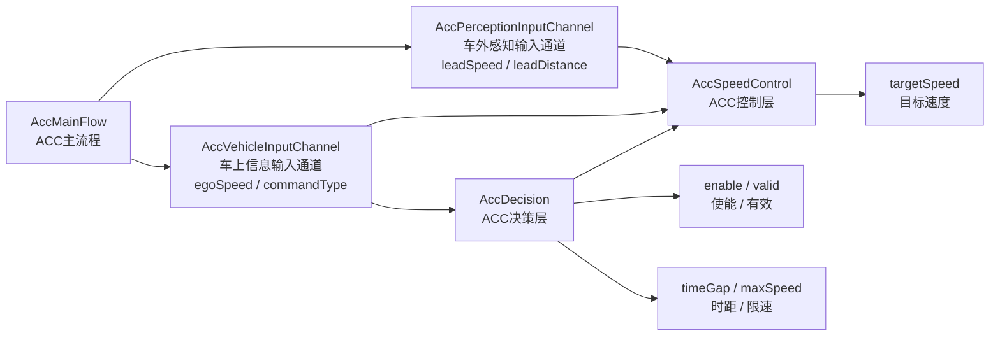

## 2. ACC 决策层：AccDecision

`AccDecision` 负责把车速、驾驶指令和内部状态转换成 ACC 决策结果。

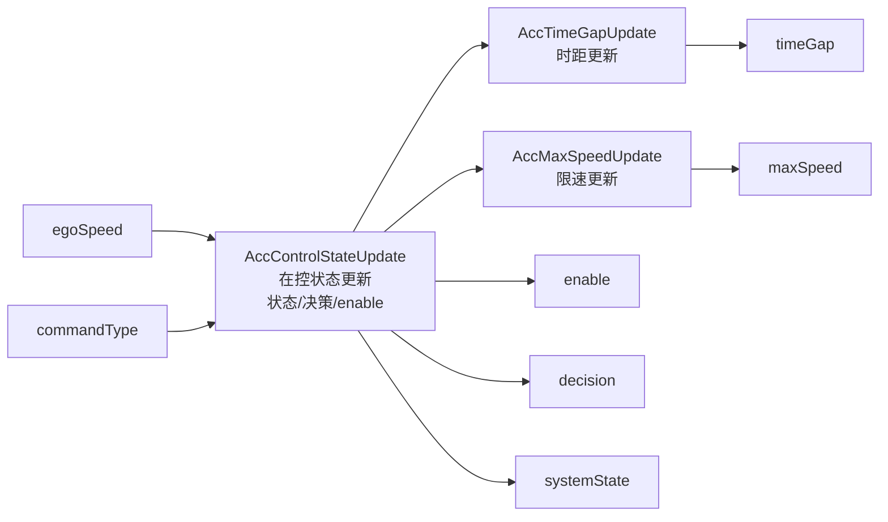

### 2.1 AccControlStateUpdate 展开

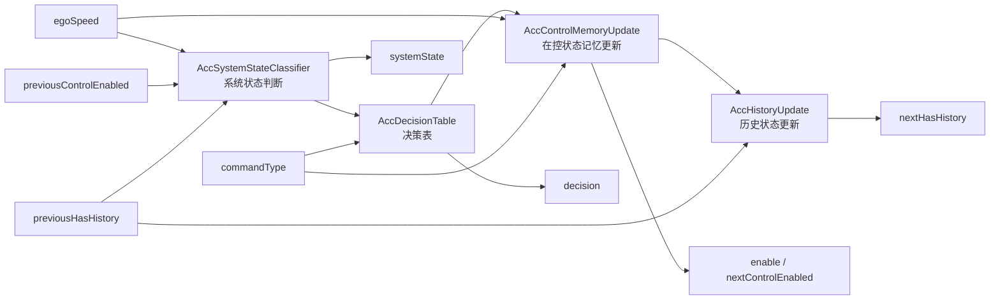

## 3. ACC 控制层：AccSpeedControl

`AccSpeedControl` 负责把跟车误差转换成目标速度。

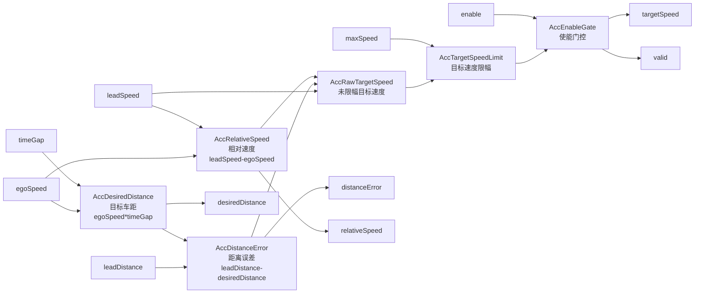

ACC 控制公式：

```text
desiredDistance = max(minDistance, egoSpeed * timeGap)
distanceError   = leadDistance - desiredDistance
relativeSpeed   = leadSpeed - egoSpeed
rawTargetSpeed  = leadSpeed + distanceGain * distanceError + speedGain * relativeSpeed
targetSpeed     = clamp(rawTargetSpeed, 0, maxSpeed)
finalOutput     = enable ? targetSpeed : 0
```

## 4. LKS 顶层：LksMainFlow

`LksMainFlow` 一级展开后应看到四块：两个输入通道、一个决策层、一个控制层。

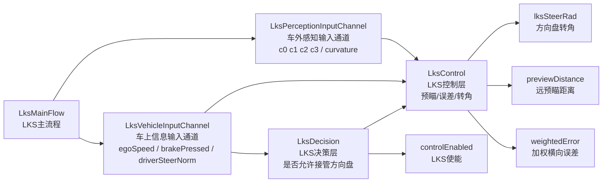

## 5. LKS 决策层：LksDecision

`LksDecision` 当前只负责控制使能判断，内部由 `LksEnableLogic` 展开。

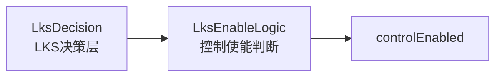

### 5.1 LksEnableLogic 展开

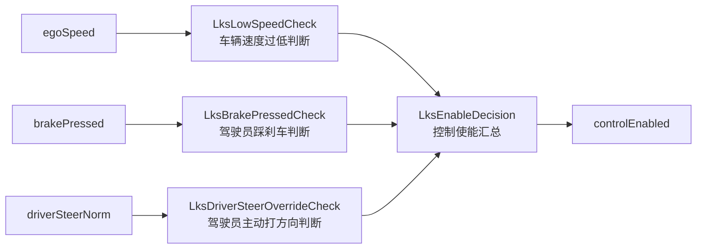

LKS 使能逻辑：

```text
speedReady     = egoSpeed >= vMin
brakeActive    = brakePressed != 0
driverOverride = abs(driverSteerNorm) >= driverSteerThreshold
controlEnabled = speedReady && !brakeActive && !driverOverride
```

## 6. LKS 控制层：LksControl

`LksControl` 包含远预瞄距离计算、三点预瞄误差模型和方向盘转角命令计算。

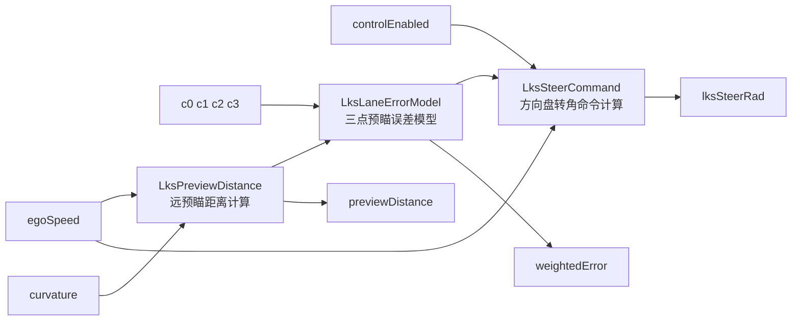

## 7. LKS 预瞄距离：LksPreviewDistance

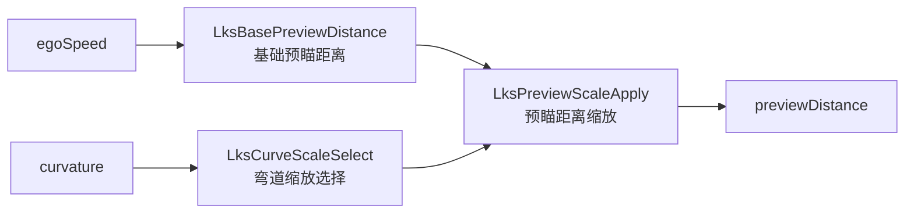

公式：

```text
basePreviewDistance = l0 + rt * egoSpeed
curvatureScale      = abs(curvature) >= curvatureThreshold ? rAlpha : 1.0
previewDistance     = basePreviewDistance * curvatureScale
```

## 8. LKS 三点预瞄误差：LksLaneErrorModel

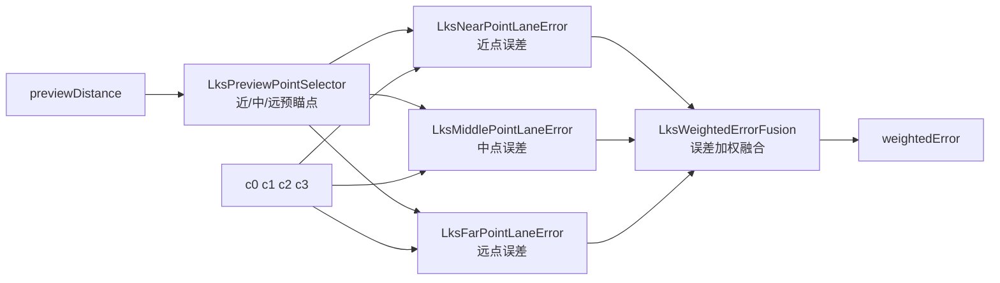

公式：

```text
nearX   = nearPreviewDistance
middleX = previewDistance / 2
farX    = previewDistance

laneError(x) = c0 + c1*x + c2*x^2 + c3*x^3

weightedError = w1*nearError + w2*middleError + w3*farError
```

## 9. LKS 转角命令：LksSteerCommand

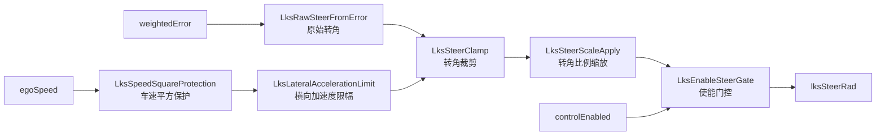

公式：

```text
rawSteerNorm = kp * weightedError
speedSquareSafe = max(egoSpeed^2, speedSquareFloor)
normalizedSteerLimit = atan(ayMax * wheelBase / speedSquareSafe) / frontWheelMaxRad
limitedSteerNorm = clamp(rawSteerNorm, -normalizedSteerLimit, normalizedSteerLimit)
scaledSteerRad = limitedSteerNorm * steerScale
lksSteerRad = controlEnabled ? scaledSteerRad : 0
```
